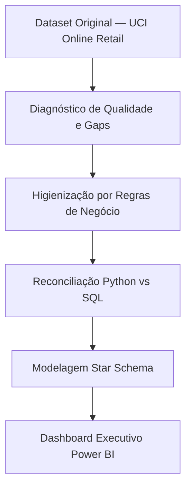

# Retail Performance Analytics: Da Transação ao Insight Executivo

**Case de Analytics Engineering que transforma dados transacionais brutos em performance estratégica auditada, com reconciliação ponta a ponta entre Python, SQL e Power BI.**

O projeto analisa o dataset *UCI Online Retail* cobrindo o ciclo completo de dados: diagnóstico de qualidade da fonte, higienização orientada a regras de negócio, reconciliação de KPIs entre camadas, análise de LTV e mix de produtos, modelagem dimensional Star Schema e dashboard executivo em Power BI com medidas DAX versionadas.

---

[](powerbi/project/)
[](https://www.python.org/)
[](https://www.sqlite.org/)
[](https://docs.pytest.org/)

---

## Resultados Auditados

Todos os números abaixo partem da base higienizada de **525.460 linhas**. O volume original da fonte (541.909) é mantido separado para fins de auditoria de qualidade.

| KPI | Resultado | Definição |
|---|---:|---|
| **Faturamento (Sales)** | **£10.642.110,80** | Soma de `Quantity × UnitPrice` na base limpa |
| **Volume de Pedidos** | **20.134** | Faturas únicas finalizadas |
| **Clientes Ativos** | **4.339** | Clientes com `CustomerID` identificado |
| **Mix de Produtos** | **3.925** | SKUs distintos com giro confirmado |
| **Ticket Médio (AOV)** | **£528,56** | Faturamento total / volume de pedidos |
| **Mercados Ativos** | **38** | Países com transações concluídas |

---

## Tech Stack

| Camada | Tecnologia | Aplicação |
|---|---|---|
| ETL e EDA | Python (Pandas, Matplotlib, Seaborn) | Higienização, exploração e extração de insights |
| Auditoria | SQL (SQLite) | Reconciliação de faturamento e validação de lógica |
| BI | Power BI (DAX, Star Schema, PBIP) | Modelagem dimensional, cálculos de tempo e UX executivo |
| Governança | Documentação de linhagem | Dicionário de medidas, scripts de auditoria, versionamento PBIP |

---

## Status do Projeto

| Frente de Trabalho | Status |
|---|---|
| Mapeamento e Diagnóstico de Dados | Completo |
| Higienização e Saneamento da Base | Completo |
| Análise de Negócio (Python) | Completo |
| Reconciliação e Auditoria de Métricas (SQL) | Completo |
| Modelagem Semântica e Especificação de KPIs | Completo |
| Dashboard Executivo (Overview) | Completo |
| Versionamento PBIP | Completo |
| Homologação Final (Power BI Desktop) | Completo |
| Deep Dive: Clientes, Produtos e Qualidade | Próxima Iteração |

---

## Pipeline de Inteligência



---

## Higienização e Integridade de Dados

| Estágio | Linhas | Delta |
|---|---:|---:|
| Base Original (Raw) | 541.909 | — |
| Base Higienizada (Final) | 525.460 | −16.449 |

A régua de higienização foi conservadora para garantir o rigor das métricas sem eliminar faturamento legítimo:

- **Registros sem descrição:** Excluídos como ruído operacional sem valor comercial rastreável.
- **Duplicatas exatas:** Removidas para evitar inflação do GMV.
- **Quantidades negativas ou nulas:** Fora da visão de vendas concluídas; mantidas em tabela de auditoria.
- **Preços negativos (estornos):** Tratados como ajustes contábeis e segregados do faturamento bruto.
- **Clientes anônimos (`CustomerID` nulo):** Incluídos no faturamento global, excluídos das métricas de comportamento de base.

---

## Dashboard Executivo Power BI

O arquivo do projeto está em `powerbi/project/` no formato **PBIP** (Power BI Project), compatível com versionamento Git. Para abrir, instale o Power BI Desktop e clique no arquivo `.pbip`.

### Página 1 — Executive Overview

Visão consolidada do negócio: faturamento, volume, ticket médio, mix de mercado e tendência temporal.

| Visual | Medida DAX | Lógica |
|---|---|---|
| Card Faturamento | `Total Sales` | `SUMX(fact_sales, fact_sales[Quantity] * fact_sales[UnitPrice])` |
| Card Volume de Pedidos | `Total Orders` | `DISTINCTCOUNT(fact_sales[InvoiceNo])` |
| Card Ticket Médio | `AOV` | `DIVIDE([Total Sales], [Total Orders])` |
| Card Clientes Ativos | `Active Customers` | `DISTINCTCOUNT(fact_sales[CustomerID])` |
| Gráfico Temporal | `Monthly Sales` | `CALCULATE([Total Sales], DATESMTD(dim_date[Date]))` |
| Mapa por País | `Sales by Country` | `CALCULATE([Total Sales], ALLEXCEPT(dim_country, dim_country[Country]))` |

### Página 2 — Análise de Clientes e Produtos

Ranking de Pareto por receita, LTV por cliente e giro de SKUs.

| Visual | Medida DAX | Lógica |
|---|---|---|
| Top 10 Clientes | `Customer LTV` | `CALCULATE([Total Sales], ALLEXCEPT(dim_customer, dim_customer[CustomerID]))` |
| Curva ABC de Produtos | `Product Revenue Share` | `DIVIDE([Total Sales], CALCULATE([Total Sales], ALL(dim_product)))` |
| Acumulado Pareto | `Cumulative Share` | `CALCULATE([Product Revenue Share], FILTER(ALLSELECTED(dim_product), [Total Sales] >= EARLIER([Total Sales])))` |
| Frequência Média de Compra | `Avg Purchase Frequency` | `DIVIDE([Total Orders], [Active Customers])` |

### Página 3 — Performance por País e Período

Mercados internacionais analisados em escala separada do Reino Unido, com comparativo YoY.

| Visual | Medida DAX | Lógica |
|---|---|---|
| Faturamento Ex-UK | `Sales Ex-UK` | `CALCULATE([Total Sales], dim_country[Country] <> "United Kingdom")` |
| Share Internacional | `International Share` | `DIVIDE([Sales Ex-UK], [Total Sales])` |
| Crescimento YoY | `YoY Sales Growth` | `DIVIDE([Total Sales] - [LY Sales], [LY Sales])` |
| Ano Anterior | `LY Sales` | `CALCULATE([Total Sales], SAMEPERIODLASTYEAR(dim_date[Date]))` |

### Página 4 — Qualidade e Integridade de Dados

Painel de transparência técnica com reconciliação ponta a ponta entre Python, SQL e Power BI.

| Visual | Medida DAX | Lógica |
|---|---|---|
| Linhas Removidas | Estático | 16.449 (calculado no ETL Python) |
| Taxa de Aproveitamento | `Data Yield` | `DIVIDE(525460, 541909)` = 96,96% |
| Receita Anônima | `Anonymous Sales` | `CALCULATE([Total Sales], ISBLANK(dim_customer[CustomerID]))` |
| Delta Reconciliação | `SQL vs Python Delta` | Diferença entre a soma Python e a consulta SQL auditada — target: £0 |

### Como Abrir e Atualizar o Dashboard

```bash
# 1. Clone o repositório
git clone https://github.com/Nayanearaujo/Retail-Performance-Analytics.git

# 2. Gere a base higienizada localmente
pip install -r requirements.txt
jupyter nbconvert --to notebook --execute notebooks/01_Data_Understanding.ipynb
jupyter nbconvert --to notebook --execute notebooks/02_Data_Cleaning.ipynb

# 3. Abra o Power BI Desktop e navegue até powerbi/project/
# Clique no arquivo .pbip para abrir o projeto

# 4. Clique em "Atualizar" no Power BI Desktop para reprocessar os dados
```

> O modelo usa caminhos relativos. Mantenha a estrutura de pastas do repositório para que a atualização funcione sem reconfiguração manual.

---

## Insights de Interpretação

- **Efeito Sazonal (Dez/2011):** A base encerra em 09/12/2011. Dezembro aparece como mês parcial e não representa queda de faturamento — é corte de fonte, não perda de tração. O dashboard sinaliza isso explicitamente com anotação no gráfico temporal.
- **Concentração UK:** O Reino Unido representa aproximadamente 84,6% do faturamento total. Os mercados internacionais são analisados em escala separada para evitar distorção visual nos rankings.
- **Receita Operacional:** Taxas de frete (`POSTAGE`) e ajustes manuais geram receita contábil, mas não são produtos. Foram isolados para não contaminar o ranking de performance de mercadorias.


---

## Estrutura do Repositório

```text
Retail-Performance-Analytics/
├── data/
│   ├── raw/                  # Dados brutos originais (UCI)
│   └── processed/            # Base higienizada gerada localmente
├── docs/                     # Modelo de dados e especificações técnicas
├── images/                   # Gráficos de evidência e assets do README
├── notebooks/                # ETL, Análise e Reconciliação
├── powerbi/
│   ├── dax/                  # Medidas DAX versionadas por página
│   ├── project/              # Arquivo PBIP (Power BI Project)
│   └── theme/                # Style Guide visual do relatório
├── scripts/                  # Validação de métricas e geração de assets
└── tests/                    # Testes de integridade da base
```

---

## Roteiro de Notebooks

| Notebook | Objetivo |
|---|---|
| `01_Data_Understanding.ipynb` | Diagnóstico de integridade, cancelamentos e cobertura da fonte |
| `02_Data_Cleaning.ipynb` | Aplicação das regras de negócio para saneamento da base |
| `03_business_analysis.ipynb` | Extração de insights de vendas, clientes, produtos e tempo |
| `04_SQL_Analysis.ipynb` | Reconciliação dos KPIs via SQL: auditoria técnica ponta a ponta |

---

## Como Reproduzir

```bash
# Instalar dependências
pip install -r requirements.txt

# Executar notebooks na ordem
jupyter lab

# Validar métricas e gerar assets de documentação
python scripts/validate_retail_metrics.py
python scripts/generate_documentation_assets.py
python -m pytest -q
```

---

## Ferramentas

Python · Pandas · Matplotlib · Seaborn · SQLite · SQL · Power BI · Power Query · DAX · GitHub

---

## Fonte e Licença

- **Dataset:** UCI Online Retail, Daqing Chen — [doi:10.24432/C5BW33](https://doi.org/10.24432/C5BW33), licença CC BY 4.0.
- **Código e documentação:** [MIT License](LICENSE).

Desenvolvido por `Nayane Araujo`
