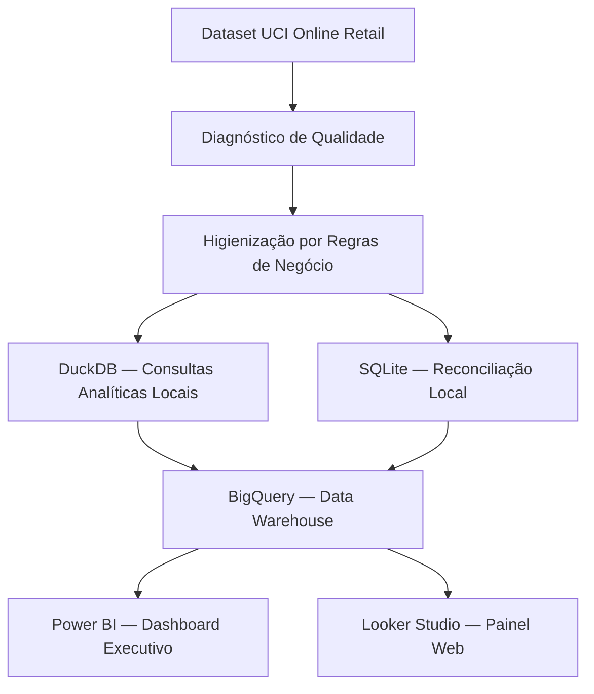
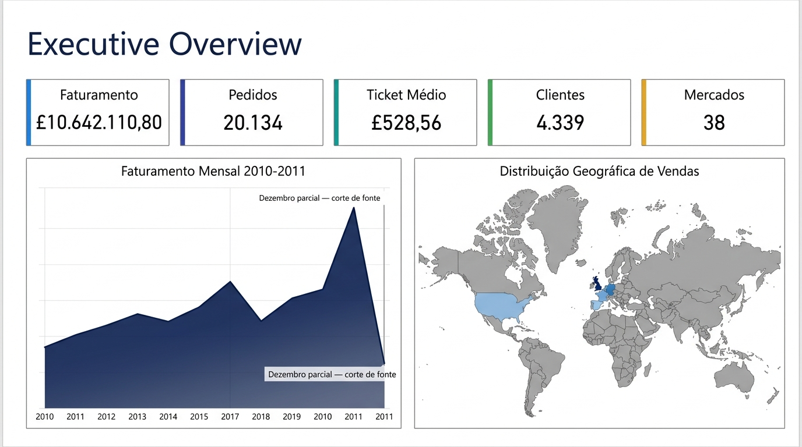
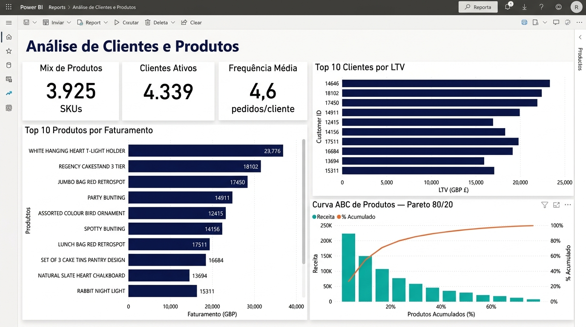
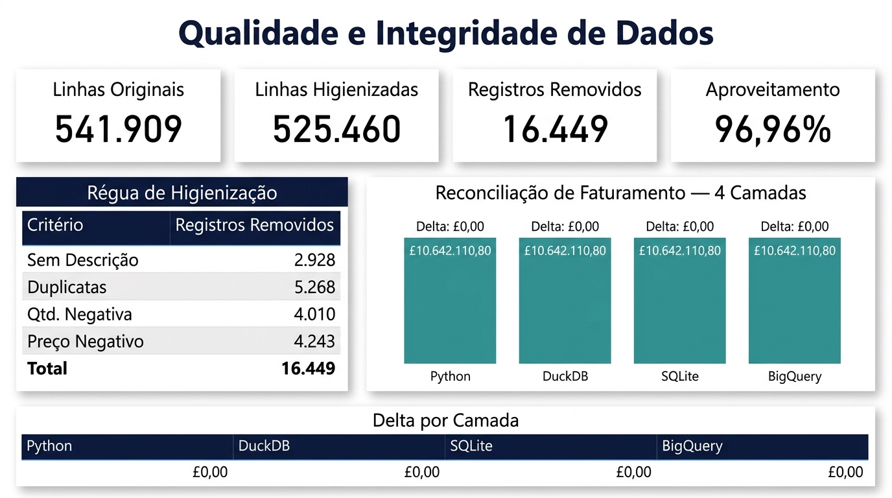

# Retail Performance Analytics: Da Transação ao Insight Executivo

**Case de Analytics Engineering com reconciliação ponta a ponta entre Python, SQL, DuckDB, BigQuery e Power BI. Os mesmos £10.642.110,80 de faturamento calculados de forma independente em quatro camadas e o delta em todas foi £0,00.**

O projeto analisa o dataset *UCI Online Retail* do início ao fim: diagnóstico da fonte, higienização por regras de negócio, reconciliação de KPIs entre camadas, análise de LTV e mix de produtos, modelagem dimensional Star Schema e dashboards executivos em Power BI e Looker Studio.

O arquivo Power BI (formato PBIP) está versionado no repositório. Cada KPI publicado foi reconciliado com a base higienizada para garantir integridade total.

---

[](powerbi/project/)
[](https://lookerstudio.google.com/)
[](https://cloud.google.com/bigquery)
[](https://duckdb.org/)
[](https://www.python.org/)
[](https://www.sqlite.org/)
[](https://docs.pytest.org/)

---

## Status do Projeto

| Frente de Trabalho | Status |
|---|---|
| Mapeamento e Diagnóstico de Dados | Completo |
| Higienização e Saneamento da Base | Completo |
| Análise de Negócio (Python) | Completo |
| Consultas Analíticas com DuckDB | Completo |
| Reconciliação Python vs SQL vs BigQuery | Completo |
| Modelagem Semântica e Especificação de KPIs | Completo |
| Dashboard Executivo Power BI (3 páginas) | Completo |
| Painel Looker Studio (Web) | Completo |
| Versionamento PBIP | Completo |
| Homologação Final (Power BI Desktop) | Completo |
| Deep Dive: Clientes, Produtos e Qualidade | Próxima Iteração |

---

## Resultados Auditados

Base higienizada de **525.460 linhas**. O volume original (541.909) é mantido separado para fins de auditoria. Todos os números abaixo fecham em Python, DuckDB, SQLite e BigQuery.

| KPI | Resultado Verificado | Definição |
|---|---:|---|
| **Faturamento** | **£10.642.110,80** | Soma de `Quantity × UnitPrice` na base limpa |
| **Pedidos** | **20.134** | Faturas únicas finalizadas |
| **Clientes Identificados** | **4.339** | `CustomerID` não nulo |
| **Produtos Vendidos** | **3.925** | SKUs distintos com giro confirmado |
| **Ticket Médio (AOV)** | **£528,56** | Faturamento ÷ pedidos |
| **Países** | **38** | Países com transações concluídas |

*As métricas partem de uma única população de 525.460 linhas. Os 541.909 registros da fonte são usados apenas na análise de qualidade e não são misturados com os KPIs de vendas.*

---

## Stack Técnico

| Camada | Tecnologia | Função no Projeto |
|---|---|---|
| Extração e EDA | Python (Pandas, Matplotlib, Seaborn) | ETL, higienização por regras de negócio, análise exploratória |
| Consultas Analíticas Leves | DuckDB | Queries SQL direto no Parquet sem servidor externo |
| Auditoria Local | SQL (SQLite) | Reconciliação de faturamento e validação de lógica |
| Data Warehouse | BigQuery | Modelo dimensional na nuvem, fonte única de verdade |
| BI Corporativo | Power BI — DAX, Star Schema, PBIP | Relatório executivo com inteligência de tempo, versionado via Git |
| BI Web Público | Looker Studio | Painel publicado na web, conectado ao BigQuery |
| Governança | Documentação de linhagem | Dicionário de medidas, scripts de auditoria, versionamento PBIP |

---

## Fluxo de Trabalho



---

## Reconciliação Entre Camadas

O mesmo KPI de faturamento foi calculado de forma independente em quatro ambientes. O delta foi **£0,00** em todas as comparações.

| Camada | Faturamento Calculado | Delta vs Python |
|---|---:|---:|
| Python (Pandas) | £10.642.110,80 | — |
| DuckDB (Parquet) | £10.642.110,80 | £0,00 |
| SQL (SQLite) | £10.642.110,80 | £0,00 |
| BigQuery | £10.642.110,80 | £0,00 |

---

## Higienização e Integridade de Dados

| Estágio | Linhas | Delta |
|---|---:|---:|
| Base Original (Raw) | 541.909 | — |
| Base Higienizada (Final) | 525.460 | −16.449 |

A régua de higienização foi conservadora para não eliminar faturamento legítimo:

- **Registros sem descrição:** Excluídos — registros operacionais sem valor comercial rastreável.
- **Duplicatas exatas:** Removidas para evitar inflação do GMV.
- **Quantidades negativas ou nulas:** Fora da visão de vendas concluídas; mantidas em tabela de auditoria.
- **Preços negativos:** Ajustes contábeis, segregados do faturamento bruto.
- **Preços zero:** Permanecem visíveis para análise de qualidade, mas contribuem £0 ao faturamento.
- **`CustomerID` nulo:** Incluído no faturamento global, excluído das métricas de comportamento de cliente.

---

## Dashboard Executivo Power BI

Arquivo em `powerbi/project/` no formato **PBIP**, compatível com versionamento Git. Instale o Power BI Desktop e clique no arquivo `.pbip`. O modelo usa Star Schema com as tabelas `fact_sales`, `dim_customer`, `dim_product`, `dim_date` e `dim_country`.

---

### Página 1 — Executive Overview

Faturamento, volume, ticket médio, tendência mensal e distribuição geográfica dos 38 mercados.

| Visual | Medida DAX | Lógica |
|---|---|---|
| **Faturamento** | `Total Sales` | `SUMX(fact_sales, fact_sales[Quantity] * fact_sales[UnitPrice])` |
| **Pedidos** | `Total Orders` | `DISTINCTCOUNT(fact_sales[InvoiceNo])` |
| **Ticket Médio** | `AOV` | `DIVIDE([Total Sales], [Total Orders])` |
| **Clientes** | `Active Customers` | `DISTINCTCOUNT(fact_sales[CustomerID])` |
| Tendência Mensal | `Monthly Sales` | `CALCULATE([Total Sales], DATESMTD(dim_date[Date]))` |
| Mapa Geográfico | `Sales by Country` | `CALCULATE([Total Sales], ALLEXCEPT(dim_country, dim_country[Country]))` |



---

### Página 2 — Análise de Clientes e Produtos

Curva de Pareto por receita, LTV por cliente, giro de 3.925 SKUs e comparativo de mercados internacionais excluindo o Reino Unido.

| Visual | Medida DAX | Lógica |
|---|---|---|
| **Top 10 Clientes** | `Customer LTV` | `CALCULATE([Total Sales], ALLEXCEPT(dim_customer, dim_customer[CustomerID]))` |
| Curva ABC | `Product Revenue Share` | `DIVIDE([Total Sales], CALCULATE([Total Sales], ALL(dim_product)))` |
| Acumulado Pareto | `Cumulative Share` | `CALCULATE([Product Revenue Share], FILTER(ALLSELECTED(dim_product), [Total Sales] >= EARLIER([Total Sales])))` |
| Frequência de Compra | `Avg Purchase Frequency` | `DIVIDE([Total Orders], [Active Customers])` |
| Mercados Ex-UK | `Sales Ex-UK` | `CALCULATE([Total Sales], dim_country[Country] <> "United Kingdom")` |
| Share Internacional | `International Share` | `DIVIDE([Sales Ex-UK], [Total Sales])` |



---

### Página 3 — Qualidade e Integridade de Dados

Painel de transparência técnica com a reconciliação ponta a ponta entre Python, DuckDB, SQLite e BigQuery.

| Visual | Medida DAX | Lógica |
|---|---|---|
| Linhas Removidas | Estático | 16.449 (calculado no ETL Python) |
| **Taxa de Aproveitamento** | `Data Yield` | `DIVIDE(525460, 541909)` = 96,96% |
| Receita Anônima | `Anonymous Sales` | `CALCULATE([Total Sales], ISBLANK(dim_customer[CustomerID]))` |
| Delta de Reconciliação | `SQL vs Python Delta` | Diferença entre soma Python e consulta SQL — target: £0,00 |
| Crescimento YoY | `YoY Sales Growth` | `DIVIDE([Total Sales] - [LY Sales], [LY Sales])` |



---

### Como Abrir e Atualizar

```bash
# 1. Clone o repositório
git clone https://github.com/Nayanearaujo/Retail-Performance-Analytics.git

# 2. Gere a base higienizada localmente
pip install -r requirements.txt
jupyter nbconvert --to notebook --execute notebooks/01_Data_Understanding.ipynb
jupyter nbconvert --to notebook --execute notebooks/02_Data_Cleaning.ipynb

# 3. Abra o Power BI Desktop e clique no arquivo em powerbi/project/
# 4. Clique em "Atualizar" para reprocessar os dados
```

> O modelo usa caminhos relativos. Mantenha a estrutura de pastas do repositório para que a atualização funcione sem reconfiguração manual.

---

## Painel Looker Studio

Versão pública do relatório conectada diretamente ao BigQuery. Acessível via browser, sem instalação.

- Fonte: tabela `fact_sales` no BigQuery, particionada por mês de fatura
- Atualização automática a cada nova carga no BigQuery
- Páginas: Faturamento por Período, Top Países (Ex-UK), Top Produtos e Clientes

---

## Pontos de Interpretação

- **Dezembro/2011 parcial:** A base encerra em 09/12/2011. O mês aparece truncado no gráfico temporal e não representa queda de faturamento — é corte de fonte. O dashboard sinaliza isso diretamente.
- **Concentração UK:** O Reino Unido responde por 84,6% do faturamento. Gráficos de mercados internacionais excluem o UK explicitamente para evitar distorção de escala.
- **Receita Operacional:** `POSTAGE`, `DOTCOM POSTAGE` e ajustes manuais geram receita contábil mas não são produtos físicos. Foram isolados dos rankings de mercadoria.


---

## Estrutura do Repositório

```text
Retail-Performance-Analytics/
├── data/
│   ├── raw/                  # Workbook original UCI
│   └── processed/            # Base higienizada gerada localmente
├── docs/                     # Modelo de dados e especificações técnicas
├── images/                   # Gráficos de evidência e assets do README
├── notebooks/                # ETL, análise e reconciliação
├── powerbi/
│   ├── dax/                  # Medidas DAX versionadas por página
│   ├── project/              # Arquivo PBIP (Power BI Project)
│   └── theme/                # Style Guide visual do relatório
├── scripts/                  # Validação de métricas e geração de assets
└── tests/                    # Testes de integridade da base
```

---

## Roteiro de Notebooks

| Notebook | Objetivo |
|---|---|
| `01_Data_Understanding.ipynb` | Diagnóstico de integridade, cancelamentos e cobertura da fonte |
| `02_Data_Cleaning.ipynb` | Aplicação das regras de negócio para saneamento da base |
| `03_business_analysis.ipynb` | Extração de insights de vendas, clientes, produtos e tempo |
| `04_SQL_Analysis.ipynb` | Reconciliação dos KPIs via SQL — auditoria técnica ponta a ponta |

---

## Como Reproduzir

```bash
pip install -r requirements.txt
jupyter lab

# Validar métricas e gerar assets de documentação
python scripts/validate_retail_metrics.py
python scripts/generate_documentation_assets.py
python -m pytest -q
```

---

## Ferramentas

Python · Pandas · Matplotlib · Seaborn · DuckDB · SQLite · SQL · BigQuery · Looker Studio · Power BI · Power Query · DAX · GitHub

---

## Fonte e Licença

- **Dataset:** UCI Online Retail, Daqing Chen — [doi:10.24432/C5BW33](https://doi.org/10.24432/C5BW33), licença CC BY 4.0.
- **Código e documentação:** [MIT License](LICENSE).

Desenvolvido por `Nayane Araujo`
