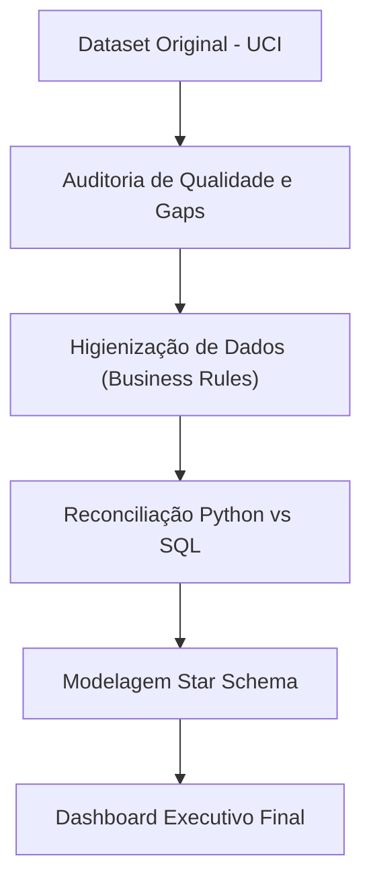
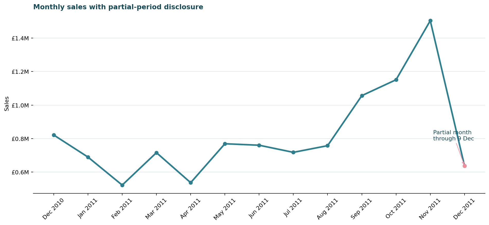
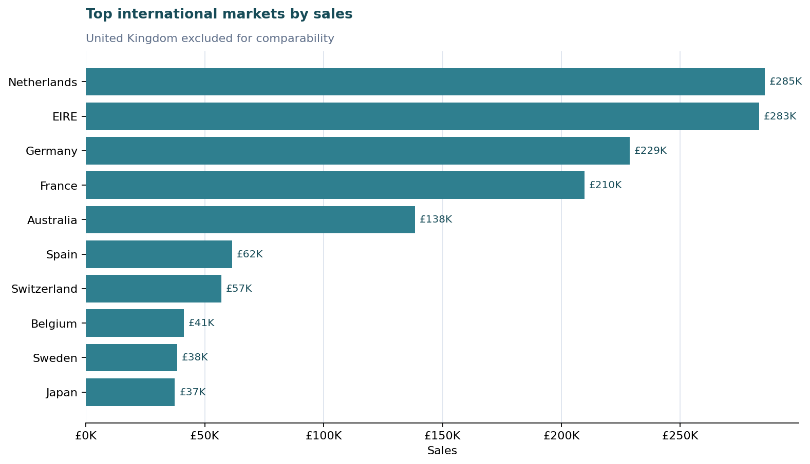

# Retail Performance Analytics: Da Transação ao Insight Executivo

**Um framework completo de Business Intelligence que transforma dados transacionais brutos em uma visão de performance estratégica, auditada e pronta para a tomada de decisão.**

Este projeto analisa o dataset *UCI Online Retail* utilizando um stack de **Python, SQL e Power BI**. O escopo cobre desde a auditoria da base (*raw data*), higienização orientada a regras de negócio, reconciliação de KPIs entre sistemas, análise de LTV e Mix de Produtos, até a modelagem dimensional e o design de dashboards executivos.

---

### 📊 [CLIQUE AQUI PARA ACESSAR O DASHBOARD INTERATIVO](https://retail-performance-pbip.ai.studio/)

---

## 🛠️ Tech Stack e Habilidades
Este repositório é um case de **Analytics Engineering** focado na "Fonte Única da Verdade" (*Single Source of Truth*):

- **Python (Pandas, Matplotlib, Seaborn):** Engine de ETL, higienização de base avançada e análise exploratória (EDA).
- **SQL (SQLite):** Reconciliação de métricas de faturamento e validação de lógica de banco de dados.
- **Power BI (DAX, Star Schema, PBIP):** Modelagem dimensional, cálculos de inteligência de tempo e UX design focado em executivos.
- **Data Governance:** Documentação de linhagem de dados, dicionário de medidas e scripts de auditoria.

> O projeto Power BI (formato PBIP) está disponível no repositório. Cada KPI apresentado foi reconciliado com a base higienizada para garantir 100% de integridade dos dados.

## Status do Projeto (Milestones)

| Frente de Trabalho | Status |
|---|---|
| Mapeamento e Diagnóstico de Dados (Understanding) | Completo |
| Higienização e Saneamento da Base | Completo |
| Business Analysis (Python) | Completo |
| Reconciliação e Auditoria de Métricas (SQL) | Completo |
| Modelagem Semântica e Especificação de KPIs | Completo |
| Dashboard Executivo (Overview) | Completo |
| Versionamento de Projeto PBIP | Completo |
| Deep Dive: Clientes, Produtos e Qualidade | Próxima Iteração |
| Homologação Final (Power BI Desktop) | Completo |

## Raio-X de Performance (Resultados Executivos)
A base analítica reflete as vendas reais após o saneamento de dados (remoção de descrições ausentes, duplicatas, cancelamentos e ajustes contábeis).

| KPI | Resultado Auditado | Conceito |
|---|---:|---|
| **Faturamento (Sales)** | **£10,642,110.80** | Receita Bruta (Soma de `Quantity × UnitPrice`) |
| **Volume de Pedidos** | **20,134** | Total de faturas únicas finalizadas |
| **Base de Clientes Ativos** | **4,339** | Clientes identificados (excluindo vendas anônimas) |
| **Mix de Produtos** | **3,925** | SKUs distintos com giro de estoque confirmado |
| **Ticket Médio (AOV)** | **£528.56** | Faturamento total dividido pelo volume de pedidos |
| **Presença de Mercado** | **38** | Países com transações ativas |

*Nota: As métricas utilizam uma base higienizada de **525.460 linhas**. O volume original da fonte (541.909) é mantido apenas para fins de auditoria de qualidade.*

## Indicadores de Negócio & Insights
1. **Performance Global:** Qual o faturamento real e volume de tração do ecossistema?
2. **Tendência & Sazonalidade:** Como o faturamento e o Ticket Médio (AOV) oscilam no funil temporal?
3. **Market Share Geográfico:** Quais praças dominam a receita e qual o peso do mercado externo?
4. **Curva de Clientes:** Quais perfis de clientes geram o maior valor para o negócio?
5. **Core Business:** Quais produtos físicos lideram as vendas após a exclusão de taxas de serviço?
6. **Data Health:** Quais gaps da fonte original podem enviesar a leitura executiva?

## Pipeline de Inteligência (Workflow)


## Higienização e Integridade de Dados

| Estágio | Volume de Linhas | Delta |
|---|---:|---:|
| Base Original (Raw) | 541,909 | — |
| Base Higienizada (Final) | 525,460 | −16,449 |

A régua de higienização foi intencionalmente conservadora para garantir o rigor das métricas:

- **Registros sem descrição:** Excluídos por serem considerados ruídos operacionais de valor zero.
- **Duplicatas:** Removidas para evitar inflar o *Gross Merchandise Volume* (GMV).
- **Ajustes de Estoque:** Quantidades negativas ou nulas foram removidas da visão de vendas concluídas.
- **Estornos:** Preços negativos foram excluídos como ajustes contábeis.
- **Clientes Anônimos:** Permanecem no faturamento global, mas são excluídos das métricas de comportamento de base.

## Insights Críticos de Interpretação

- **Efeito Sazonal (Dez/2011):** A base encerra em 09/12/2011. Dezembro é um mês parcial e não deve ser lido como queda de faturamento ou perda de tração.
- **Market Share UK:** O Reino Unido detém aproximadamente 84.6% do share. Analisamos os mercados internacionais separadamente para evitar distorções de escala.
- **Receita Operacional:** Taxas de frete (POSTAGE) e ajustes manuais geram receita, mas não são produtos. Foram isolados para não poluir o ranking de performance de mercadorias.





## Arquitetura do Relatório Power BI
O dashboard foi estruturado em três camadas de análise:
Executive Overview: Faturamento, volumetria, Ticket Médio e mix de mercado.
Customer & Product Analysis: Ranking de Pareto, giro de mercadorias e comportamento de compra.
Data Quality & Definitions: Transparência técnica, reconciliação de base e dicionário de KPIs.

## Estrutura do Repositório
```text
Retail-Performance-Analytics/
├── data/
│   ├── raw/                  # Dados brutos originais (UCI)
│   └── processed/            # Base higienizada gerada localmente
├── docs/                     # Modelo de dados e especificações técnicas
├── images/                   # Evidências gráficas e assets do README
├── notebooks/                # Documentação do ETL, Análise e Reconciliação
├── powerbi/
│   ├── dax/                  # Repositório de medidas versionadas
│   ├── project/              # Arquivo PBIP (Power BI Project) completo
│   └── theme/                # UI/UX Style Guide do relatório
```
## Roteiro de Análise (Notebook Roadmap)
|Ordem dos Notebooks | Objetivo |
|---|---|
| `01_Data_Understanding.ipynb` | Diagnóstico de integridade, cancelamentos e cobertura da fonte.
| `02_Data_Cleaning.ipynb` | Aplicação das regras de negócio para saneamento da base.
| `03_business_analysis.ipynb` | Extração de insights de vendas, clientes, produtos e tempo.
| `04_SQL_Analysis.ipynb` | Auditoria Técnica: Reconciliação dos KPIs utilizando SQL.

## Como Reproduzir o Projeto
Instale as dependências:
```bash
python -m pip install -r requirements.txt
jupyter lab
```
### Execute os notebooks na ordem numérica.
Para validar o projeto e gerar os ativos de documentação:
```bash
python scripts/validate_retail_metrics.py
python scripts/generate_documentation_assets.py
python -m pytest -q
```
🛠️ Ferramentas Utilizadas (Tools Used)
Python · pandas · matplotlib · seaborn · SQLite · SQL · Power BI · Power Query · DAX · GitHub Actions

📖 Fonte e Licença (Source and License)
Dataset: UCI Online Retail, Daqing Chen, licenciado sob CC BY 4.0.
Código e Documentação: MIT License.

Desenvolvido por Nayane Araujo
